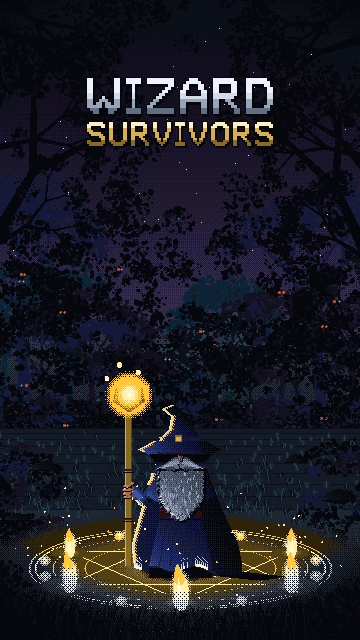
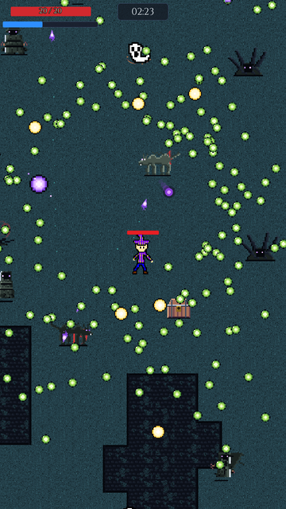
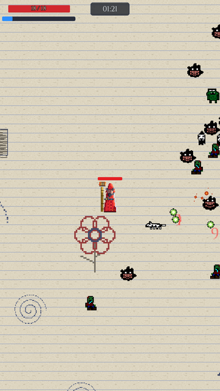

# Wizard Survivors

A 2D auto-shooter roguelite in the Vampire Survivors mould: you move, your spells fire
themselves, and the question every run asks is what you picked and where you stood.

Built in Godot 4.5 (Mono, .NET 9). **Every sprite and every sound in it was generated by a
script** — there are no painted assets and no sampled audio. That is the interesting part of this
repository, and most of what follows is about it.

<p align="center">
  
</p>

<p align="center">
  
  &nbsp;&nbsp;
  
</p>

---

## The art is code

**506 sprites and 187 ground tiles**, drawn by forty-six Python generators in
[`tools/art/`](tools/art). Not exported from an editor — *drawn in code*, pixel by pixel, against
a fixed palette. One command rebuilds every image in the game:

```
python tools/art/build.py
```

The rules they are drawn to are written down in [`.ai/art-direction.md`](.ai/art-direction.md):
five-tone material rows for objects, four-tone emissive ramps for effects, one occlusion colour
shared by everything, a single key-light direction, and an audit that fails a sprite containing a
colour the palette does not define. The bosses are in
[`sprite_bosses.py`](tools/art/sprite_bosses.py), the ground in [`tiles.py`](tools/art/tiles.py),
the relic icons in [`relic_icons.py`](tools/art/relic_icons.py).

**69 sound effects**, synthesised by [`tools/audio/`](tools/audio) — no library, no recordings.
The reasoning, including why a sound's loudness is set by how *often* it plays rather than how
important it feels, is in [`.ai/audio-direction.md`](.ai/audio-direction.md).

A warning if you intend to run any of it: the generators are **Python 2.7 with PIL**, because
that is what was on the machine. No numpy, no f-strings, no `math.tau`.

## The Sketchbook chapter was drawn by my kids

Twelve sprite sheets, used exactly as drawn — cropped and repacked, never repainted. They are the
entire cast of one chapter: eight enemies, a boss, its projectile, a companion dog that cannot be
killed, and a chasing enemy that alternates between a smiling face and a frowning one.

They drew a creature that squashes down and then leaps, on two separate sheets, without being
asked for one. That is a wind-up and a dash, so it became the chapter's charging enemy and needed
no new code at all.

Please read the [`NOTICE`](NOTICE) file before doing anything with that folder.

## What is in the game

| | |
|---|---|
| Chapters | 8 campaign chapters plus the Sketchbook, each ending in a boss |
| Bosses | 9 — among them three bodies that must all be silent at the same moment, one that sheds pieces of itself, a burrower, and a finale that quotes the rest |
| Spells | 30, with evolutions and level-up branches |
| Wizards | 7 |
| Relics | 29, in 10 Full Set Enchantments |
| Boons | 14 |

The bosses were designed as outlines before a pixel of detail was placed — a T, a bell, a dome, a
slab, a wedge, an S and an H — on the theory that a player meeting them fifteen minutes apart
across eight hours reads a silhouette once, in the half second before deciding which way to run.
The argument is at the top of [`tools/art/sprite_bosses.py`](tools/art/sprite_bosses.py); the
behaviours and the primitives they share are in
[`.ai/enemy-behaviour.md`](.ai/enemy-behaviour.md).

## Running it

You need **Godot 4.5 Mono** and the **.NET 9 SDK**.

```
dotnet build WizardSurvivors.sln     # ~6s, catches nearly every C# error
godot --path .                       # run it
```

The first launch imports around two thousand images and takes several minutes. Until it finishes,
scene loads fail with `Unrecognized UID` — that means *not imported yet*, not *broken*.

`dotnet build` validates no scene wiring, resource path or signal connection. Only Godot does.
There is a startup validator (`ContentValidator` + `RegressionChecks`) that checks the things a
compiler cannot see — that every spell has an unlock, that no enemy attack has a zero-length
wind-up, that no boss telegraph draws one shape and hits another — and it prints to the Godot
console on launch.

## Layout

```
scripts/      ~120 C# files, flat — no subdirectories
scenes/       ~85 .tscn, flat
SpellData_*.tres, CharacterData_*.tres   at the repo root, where they all live
assets/       generated art, synthesised audio, the kids' drawings
tools/        the generators, and the headless probes that photograph the game
.ai/          22 design documents — the actual source of truth for decisions
```

`.ai/` is not documentation written after the fact. It is where a decision is argued out before
it is built, and where the reasoning survives after the code has changed shape. If you only read
one, read [`.ai/world-and-tone.md`](.ai/world-and-tone.md) — it decides why the player is alone,
why the horde has no faction colour, and it is the reason a friendly dog is allowed in exactly
one chapter and nowhere else.

## Licence — please read it

**This repository is public so the work can be read. Nothing in it is offered for reuse.**

Not the art, not the audio, not the C#, not the generators. It is not MIT, not GPL, not Creative
Commons — see [`LICENSE`](LICENSE) for what you may and may not do, and [`NOTICE`](NOTICE) for
the third-party fonts that carry their own terms and for where everything under `assets/` came
from.

The generators are covered by the same terms as the art they produce. A permission that covered
`build.py` but not the sprites it writes would be no permission at all.

If you want to use something here, open an issue and ask. Asking costs nothing.
